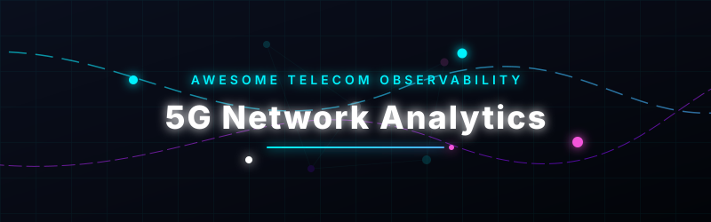

  

# Awesome 5G Network Analytics 📶📊

  

> A curated list of awesome **5G Network Analytics** platforms, standardized **NWDAF** (Network Data Analytics Function) implementations, **O-RAN (Open RAN)** monitoring tools, and telecom observability stacks.

## 📖 Introduction to 5G Network Analytics Platforms 🔍🕵️‍♂️

**5G Network Analytics** software collects, processes, and analyzes performance telemetry data from **Radio Access Networks (RAN)**, **5G Core (5GC)**, and **User Equipment (UE)**. These systems provide critical services including:
* **KPI Monitoring** (Key Performance Indicators)
* **Anomaly Detection** & **Root-Cause Analysis (RCA)**
* **Capacity Planning** & **Network Optimization**
* **Quality of Experience (QoE)** and Subscriber Experience Management
* **AI/ML-Driven Predictive Insights** for 4G/5G/6G networks

Below is a curated list of notable platforms and open-source equivalents. Commercial-grade telecom suites with multi-vendor correlation and large-scale AI are presented alongside open-source building blocks, NWDAF tools, RIC monitoring agents, and general observability frameworks adapted for telecommunication networks.

---

## 🏢 SaaS / Hosted Platforms

| Platform | Description | Pricing | Free Tier / Limit | Company Size (Est. Revenue/Valuation) |
| :--- | :--- | :--- | :--- | :--- |
| **[Ericsson Expert Analytics](https://www.ericsson.com/)** | Advanced analytics platform focused on network performance, subscriber experience, and operational intelligence. | Custom (Contact Sales) | None | ~$25 Billion (Annual Revenue) |
| **[Nokia AVA](https://www.nokia.com/)** | AI-powered analytics and automation suite for multi-domain network assurance, optimization, and predictive insights. | Custom (Contact Sales) | None | ~$24 Billion (Annual Revenue) |
| **[Viavi](https://www.viavisolutions.com/)** | Network testing, assurance, and analytics solutions covering RAN, core, and service quality for 5G. | Custom (Contact Sales) | None | ~$1.1 Billion (Annual Revenue) |
| **[Accedian](https://www.accedian.com/)** | Performance analytics and assurance focused on quality of experience and network visibility. | Custom (Contact Sales) | None | ~$370 Million (Valuation on acquisition by Cisco) |
| **[Cellwize](https://www.cellwize.com/)** (now part of larger portfolios) | RAN automation and analytics platform. | Custom (Contact Sales) | None | ~$350 Million (Valuation on acquisition by Qualcomm) |
| **[EXFO](https://www.exfo.com/)** | Test, monitoring, and analytics portfolio for fiber, 5G, and service assurance. | Custom (Contact Sales) | None | ~$300 Million (Annual Revenue) |
| **[Mobileum](https://www.mobileum.com/)** | Analytics and security platform for roaming, fraud, and network intelligence. | Custom (Contact Sales) | None | ~$300 Million (Annual Revenue) |
| **[Infovista](https://www.infovista.com/)** | Network performance management, planning, and analytics for mobile operators. | Custom (Contact Sales) | None | ~$200 Million (Annual Revenue) |
| **[Subex](https://www.subex.com/)** | Revenue assurance, fraud management, and network analytics solutions for telecom operators. | Custom (Contact Sales) | None | ~$34 Million (Annual Revenue) |
| **[Matellio Telecom Analytics](https://www.matellio.com/)** | Custom and productized analytics solutions for 5G networks. | Custom (Contact Sales) | None | ~$15 Million (Annual Revenue) |

## 🔓 Open-Source Software

### 🚀 5G Core / RAN Stacks with Analytics Capabilities
- **[Open5GS](https://github.com/open5gs/open5gs)**  — Open-source 5G core (and 4G EPC) frequently used in testbeds; can be instrumented for performance monitoring and analytics.
- **[Free5GC](https://github.com/free5gc/free5gc)**  — Popular open-source 5G core network implementation. Community and research projects add **NWDAF** (Network Data Analytics Function) support for event-driven analytics, subscription/notification, and predictive insights.
- **[srsRAN](https://github.com/srsran/srsRAN_Project)**  — Open-source 4G/5G RAN software suite. Useful for generating realistic traffic and KPIs in lab environments.
- **[OpenAirInterface (OAI)](https://openairinterface.org/)**  — Full-stack open-source 5G RAN and core. Widely used for research, with extensions for telemetry, xApps, and analytics.
- Open-source NWDAF implementations — Multiple research and community projects integrate NWDAF with Free5GC, Open5GS, or OAI to provide standardized 5G analytics (event exposure, ML-based insights, closed-loop automation).

### 📡 O-RAN & RAN Intelligent Controller (RIC) Monitoring
- **[FlexRIC](https://gitlab.eurecom.fr/mosaic5g/flexric)**  / SD-RAN related projects — Open near-real-time RIC frameworks that enable xApps for RAN monitoring, KPI collection, and analytics.
- **[5G-Spector](https://github.com/5GSEC/5G-Spector)**  and similar O-RAN xApps — Security and monitoring xApps that extract fine-grained RAN telemetry (e.g., MobiFlow) for analysis and anomaly detection.
- Community O-RAN monitoring stacks that combine E2 interface metrics with Prometheus/Grafana or Zabbix.

### 📊 General Observability & Analytics Tooling (Highly Adaptable)
- **[Grafana](https://grafana.com/)**  — De-facto open-source visualization and analytics platform. Widely used to dashboard 5G KPIs, logs, and metrics.
- **[Prometheus](https://prometheus.io/)**  — De-facto open-source monitoring and alerting toolkit. Widely used to scrape 5G KPIs, logs, and metrics.
- **[OpenTelemetry](https://opentelemetry.io/)**  — Vendor-neutral observability framework for traces, metrics, and logs; increasingly applied to telecom workloads.
- **[MobileInsight](https://github.com/mobileinsight-project)**  (and 5G extensions) — UE-side protocol tracing and analytics tool for cellular networks.
- ELK / OpenSearch stack — For log aggregation, search, and analytics of network events and KPIs.

### 🧪 Supporting & Research-Oriented Tools
- 5G Trace Analyzer and similar open-source sequence/trace analysis tools for decoding and visualizing 5G signaling.
- NVIDIA Aerial components (parts being open-sourced) — CUDA-accelerated RAN and digital-twin related software useful for AI-native analytics research.
- Various GitHub projects for 5G KPI anomaly detection, root-cause analysis (RAG-based assistants), and traffic generators that feed analytics pipelines.

### 🛠️ Typical Open-Source Approach
Operators and researchers commonly assemble:
1. An open 5G core/RAN (Free5GC, Open5GS, OAI, or srsRAN)
2. Telemetry collection via NWDAF, xApps, or exporters
3. Prometheus + Grafana (or OpenTelemetry) for storage and dashboards
4. Optional ML pipelines for anomaly detection and prediction

This stack provides strong visibility and experimentation capability, though it requires more integration effort than commercial multi-vendor analytics platforms.

---

**🤝 How to contribute**  
Fork this repository, add a new project (with link + short description + category), and open a pull request.  
Prefer actively maintained open-source projects related to 5G analytics, NWDAF, O-RAN monitoring, or telecom observability.

**📄 License**  
This list is public domain / CC0. Feel free to copy into your own awesome list or README.

Star the projects you find useful — open 5G analytics and observability tooling continues to grow with the O-RAN and open-source 5G ecosystems! 📶

##  Star History

<a href="https://www.star-history.com/?repos=ishandutta2007%2FAwesome-5g-Network-Analytics&type=date&legend=bottom-right">
<picture>
<source media="(prefers-color-scheme: dark)" srcset="https://api.star-history.com/chart?repos=ishandutta2007/Awesome-5g-Network-Analytics&type=date&theme=dark&legend=bottom-right" />
<source media="(prefers-color-scheme: light)" srcset="https://api.star-history.com/chart?repos=ishandutta2007/Awesome-5g-Network-Analytics&type=date&legend=bottom-right" />

</picture>
</a>

